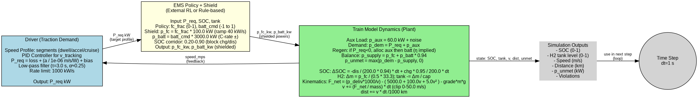

# Env0 Detailed Simulation Diagram

## Overview
This diagram illustrates the full Env0 environment from `rl_hyb_train/env0_env.py`, showing the interaction between components: Driver (traction demand), Agent (EMS policy), Shield (safety constraints), Plant (dynamics), Observation Builder, and Reward Calculator. All formulas are exact from the codebase (`powerflow.py`, `driver.py`, `shield.py`, etc.), with numeric constants substituted from `conf.yaml` for clarity.

The flow is a standard Gym loop: `reset()` initializes randomization (mass, SOC, tank, length), pre-computes initial `P_req`; then `step(action)`: shield → plant advance → reward → obs → loop until termination (low SOC/tank) or truncation (time).

Key features:
- **POMDP**: Hidden vars (passenger mass U[180-260]t, aux bias RW σ=0 kW).
- **Shielded Actions**: Constrains FC ramp (40 kW/s), SOC corridor (0.20-0.90), C-rates.
- **Power Balance**: Handles regen allocation (aux first, then battery, friction last), unmet demand.
- **Kinematics**: Davis resistance + grade forces for realistic speed/distance.
- **Reward**: Negative costs (H2 €6/kg, grid €0.18/kWh, smoothness λ=0.01, delay λ=0.5, unmet λ=1e-6).
- **Obs**: 12D normalized [-1,1] (speed, noisy SOC/tank, time-to-stop, grade, filtered P_req + trend, last action, 3x noise).

For interactive viewing, paste `docs/env0_diagram.mmd` into [mermaid.live](https://mermaid.live).


## Simulink-Style Block Diagram
This hierarchical block diagram mimics MATLAB Simulink, representing Env0 as interconnected subsystems with signal flows (e.g., p_req_kw from Driver to Plant, action to Shield). Blocks include key equations (e.g., power balance sum, SOC integrator, PID in Driver). Subsystems like Plant show internal structure (power balance, SOC/H2 tanks, kinematics with Davis forces). Constants (e.g., η_fc=0.50, gain=1e-6) are labeled on blocks/edges. Generated via Graphviz DOT for clean layout.


**Troubleshooting Preview**: If the diagram doesn't appear, verify files exist (run regeneration below). PNG for non-SVG previews; install "Markdown Preview Enhanced" for full support. View in browser or mermaid.live for .mmd.

## Physics Simulation Block Diagram
Focused on the core physics simulation loop (excluding Gymnasium RL aspects like observations, agent, reward, termination). This diagram highlights the Driver (traction demand generation), Shield (safety constraints on powers), and Plant (physical dynamics: auxiliaries, regenerative braking allocation, power balance, SOC/H2 tank integrators, kinematics with Davis resistance and grades). Signal flows include p_req_kw from Driver to Plant, p_fc_kw/p_batt_kw from Shield to Plant, speed feedback from Plant to Driver. Plant subsystem breaks down internal blocks (e.g., Aux Generator, Regen Allocator, Power Balance Sum, SOC/H2 Integrators, Kinematics). All key formulas (e.g., p_dem = p_req + p_aux, ΔSOC = -dis/(E*η_dis)*dt_h + ..., F_resist = A + Bv + Cv²) and constants (e.g., η_fc=0.50, gain=1e-6) are labeled on blocks/edges for engineering clarity.

Generated via Graphviz DOT for Simulink-like block representation.


## Simplified Block Diagram
High-level overview focusing on the core loop: Driver (P_req generation from speed profile and PID), EMS Policy + Shield (action to safe powers), and Plant (train model dynamics: power balance, SOC/H2 depletion, kinematics). Arrows show key signals (P_req kW, p_fc/p_batt kW, speed feedback). Formulas summarized in blocks (e.g., Driver PID/filter, Plant balance/ΔSOC/kinematics with η, gains). Excludes RL obs/reward for simplicity. Generated via Graphviz DOT.



## Detailed Block Diagram (Expanded Subs)
Expands the EMS and Plant blocks into subgraphs: EMS includes external Policy and detailed Shield subs (Ramp Limiter, SOC Guard, C-rate Limiter, Tank Check with specific clamps like SOC corridor 0.20-0.90, ramp 40 kW/s). Plant subs: Aux Generator, Regen Allocator, Power Balance, SOC/H2 Integrators, Kinematics (Davis + grade). Main flow: Driver → EMS → Plant (speed feedback). Formulas/constants labeled (e.g., ΔSOC eq., PID gains, F_resist). No Gym/RL—focus on EMS+physics hierarchy.

Generated via Graphviz DOT.


## Key Constants from conf.yaml
Constants are loaded dynamically in `scripts/gen_env0_diagram.py` via `Config.from_yaml("conf.yaml")`. Below are the main ones used in formulas (defaults shown; actual from file).

### Plant & Power Flow
- `dt_seconds`: 1 s (time step; dt_h = 1/3600 h)
- `p_aux_base_watts`: 60000 W (60 kW base aux; + RW bias σ=0 kW)
- `p_loss_watts`: 200000 W (200 kW fixed loss)
- `v_max_mps`: 50 m/s (max speed)
- `kinematic_gain_mps_per_watt`: 1.0e-6 m/s/W (accel to power conversion)
- Davis resistance: A=5000 N, B=100 N/(m/s), C=5 N/(m/s)²
- Passenger mass: U[180, 260] tons (hidden)
- Battery: E_batt=200 kWh, η_discharge=0.94, η_charge=0.95, P_dis_max=3000 kW, P_chg_max=1000 kW
- Fuel Cell: P_fc_max=100 kW, η_fc=0.50, LHV_H2=33.3 kWh/kg, tank_cap=50 kg

### Shield
- SOC soft: min=0.20, max=0.90 (corridor enforcement)
- SOC hard: min=0.15, max=1.00
- FC ramp: 40 kW/s (dt=1s → ±40 kW/step)
- Tank hard min: 0.02 (block FC if ≤)
- C-rate caps: enforce P_batt ∈ [-1000, 3000] kW

### Driver
- P_req smoothing: τ=3 s (α=dt/(τ+dt)=0.25)
- Rate limit: 1000 kW/s (dp_max=1000 kW/step)
- Speed target smoothing: τ=14 s
- PID: Kp=0.004, Ki=0.04, Kd=0.03; integral limit=0.6 m/s
- Accel limits: +0.20 m/s², brake -0.25 m/s²; jerk=0.10 m/s³
- Planner: horizon=14 s, min=6 s; penalty_accel=0.15, jerk=0.05
- Deadband=0.2 m/s, separation=0.6 m/s; filter τ_meas=5 s, deriv=1.5 s
- Power clip: ±500 kW; loss=200 kW
- Dwell threshold: 0.4 m/s
- Grades: [0.009, 0.0238, 0.009, -0.018, -0.018, 0.018] % (from segments)
- Episode len: U[1800, 2400] steps

### Observations
- Normalize: [-1, 1] Box (shape=12, float32)
- P_req_max=2000 kW (for obs[5])
- Trend max=1000 kW/s (obs[6])
- Noise: σ_SOC=0.02, σ_tank=0.02, σ_nuisance=0.1 (3 channels)
- Time-to-stop: /600 s (~10 min max)
- Grade norm: /5 % (±5% assumed)

### Reward
- H2 cost: €6.0 /kg
- Grid cost: €0.18 /kWh (charging only)
- λ_smooth=0.01 (||action diff||_2)
- λ_delay=0.5 (cumulative delay_s * dt)
- λ_unmet=1e-6 (* p_unmet kW)
- Delay: from speed_error >0.5 m/s vs target (renderer-enabled)

## Regeneration
To update the diagram (e.g., after conf.yaml changes):
```
uv run python scripts/gen_env0_diagram.py
npx @mermaid-js/mermaid-cli -i docs/env0_diagram.mmd -o docs/env0_diagram.svg
npx @mermaid-js/mermaid-cli -i docs/env0_diagram.mmd -o docs/env0_diagram.png --width 3000 --height 2000 --scale 2
uv run python scripts/gen_env0_simulink.py  # For Simulink PNG
uv run python scripts/gen_env0_physics.py   # For physics-only PNG
uv run python scripts/gen_env0_simple.py    # For simplified PNG
uv run python scripts/gen_env0_detailed.py  # For detailed subs
```
Requires: uv (for deps), npm/npx (for mermaid-cli), graphviz (dot).

For source: See `scripts/gen_env0_diagram.py` (extracts via Config, builds Mermaid string with subgraphs/flows).
